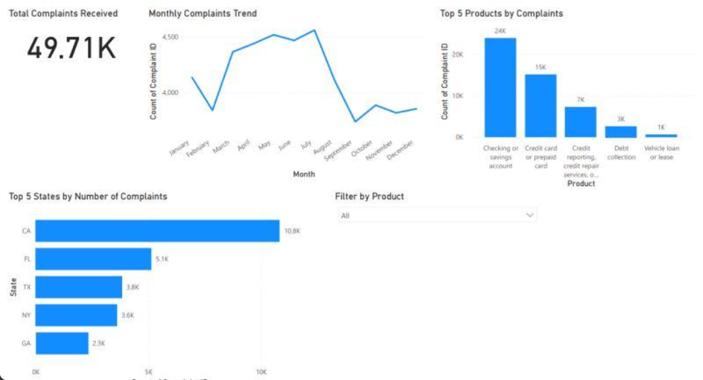

# Financial Consumer Complaints Analysis: Bank of America (2017-2023)

A Power BI dashboard analysing 62K+ consumer complaints related to Bank of America's financial products and services, covering 2017 to 2023.

> **Note:** The original `.pbix` file is no longer available. This repo showcases the dashboard through a screenshot, along with a summary of the approach and key insights.
>
> 
>
> ---
>
> ## Project Objective
>
> To analyse consumer complaint patterns against Bank of America, identifying which products generate the most complaints, how complaint volume trends over time, and which states raise the most issues.
>
> ---
>
> ## Data Source
>
> Consumer complaint dataset for Bank of America financial products and services, 2017-2023 (source not retained). After cleaning and refining, the working dataset totalled 49,713 records.
>
> ---
>
> ## Tools & Skills Used
>
> | Stage | Tools |
> |---|---|
> | Data cleaning & transformation | Power Query |
> | Data modelling | Power BI |
> | Calculated metrics | DAX (KPI cards, trend lines) |
> | Dashboard development | Power BI Desktop |
> | Interactivity | Product filter |
>
> ---
>
> ## Dashboard Overview
>
> - Total Complaints Received: 49.71K
> - - Monthly Complaints Trend: line chart showing complaint volume rising from around 4,000 to a peak near 4,500 mid-year, before falling sharply toward year-end
>   - - Top 5 Products by Complaints: Checking or savings account (24K), Credit card or prepaid card (15K), Credit reporting or repair services (7K), Debt collection (3K), Vehicle loan or lease (1K)
>     - - Top 5 States by Number of Complaints: California (10.8K), Florida (5.1K), Texas (3.8K), New York (3.6K), Georgia (2.3K)
>       - - Interactive Filter: filter by product for deeper analysis
>        
>         - ---
>
> ## Key Insights
>
> - Checking or savings account complaints dominate, at 24K, more than the next two categories combined, suggesting deposit account issues are the primary friction point for customers
> - - Complaint volume is heavily seasonal, rising steadily through the first half of the year before a sharp drop after the summer peak, an area worth investigating for root cause
>   - - California alone accounts for roughly double the complaints of the next highest state, Florida, worth normalising against customer base for a fairer comparison
>    
>     - ---
>
> ## Repo Contents
>
> README.md and fincomplaints.png
>
> ---
>
> ## About
>
> Independent Power BI project, part of a self-directed portfolio built to strengthen data analytics and dashboard design skills. Completed August 2025.
> 
